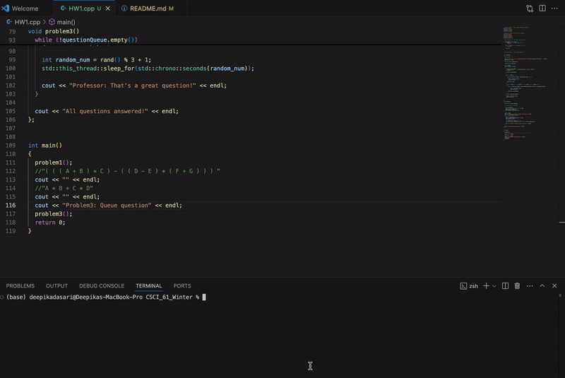
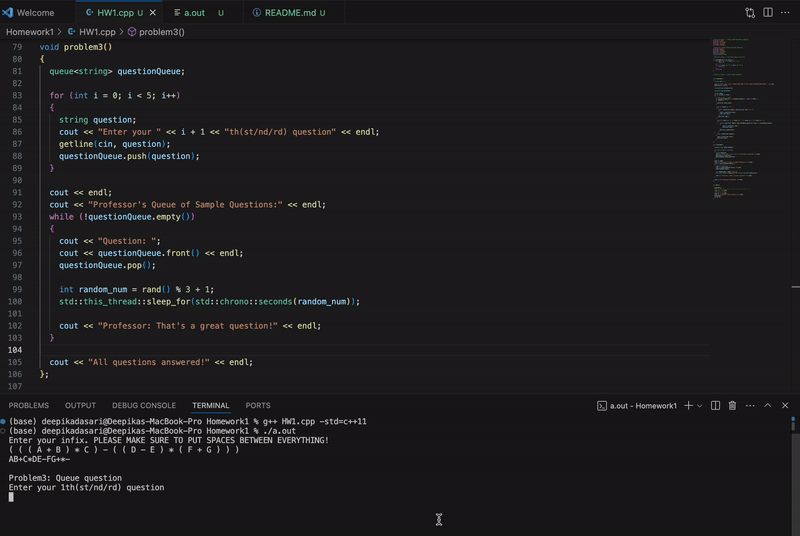
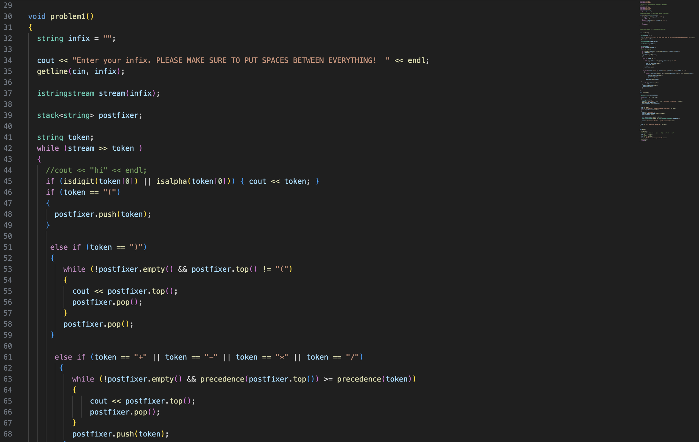
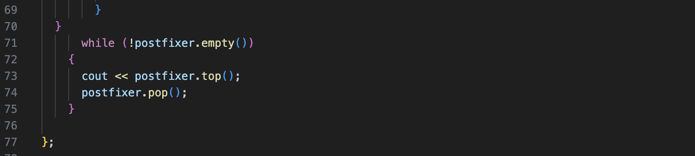

# Homework_1

##### Abhinav Pala

### Stack Section

Download the Homework1 folder and open it your prefferred editor.

Make sure that you have a g++
compiler that compiles to C++ 11

run the following command in your
terminal

```
g++ HW1.cpp -std=c++11
```

Then run the following command

```
./a.out
```

The first prompt you will see will ask you to enter 
a infix expression with whitespace in the middle

For example, isntead  of this:
```
"A*B+C*D"
```
enter this:
```
"A * B + C * D"
```
Every token must be seperated with space

If your infix has multiple digit numbers, DO NOT seperate those characters.

You MUST enter them like this.

```
"22 * 23 + 24"
```
NOT

```
"2 2 * 2 3 + 2 4"
```

This would result in an error


##### Note: Quotation marks arent necessary, I am trying to denote they are strings

Here is a video demonstration on how to use problem 1




### Queue Section

This will run immediatly after the first question is done.
You will be indicated that Problem 3 has begun.

You must enter five questions. You will be prompted to enter
them one by one. Just enter them like any other input

here is another video demonstration of PROBLEM 3




That is the homework assignment.

Here is a screenshot of problem 1 from stack section
since it was two big to fit in the screen recording




